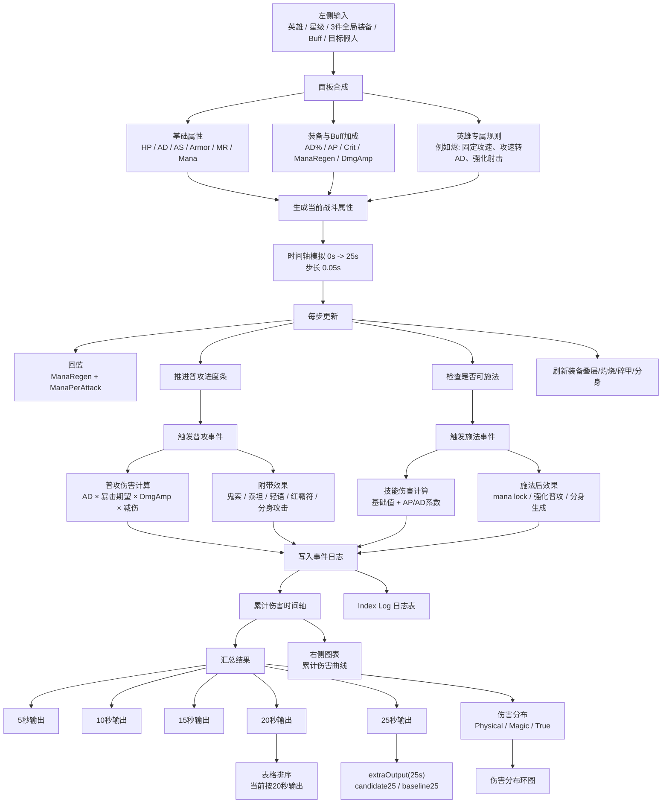

# Set 17 DPS 计算流程图

```mermaid
flowchart TD
  A["左侧输入<br/>英雄 / 星级 / 3件全局装备 / Buff / 目标假人"] --> B["面板合成"]
  B --> B1["基础属性<br/>HP / AD / AS / Armor / MR / Mana"]
  B --> B2["装备与Buff加成<br/>AD% / AP / Crit / ManaRegen / DmgAmp"]
  B --> B3["英雄专属规则<br/>例如烬: 固定攻速、攻速转AD、强化射击"]

  B1 --> C["生成当前战斗属性"]
  B2 --> C
  B3 --> C

  C --> D["时间轴模拟 0s -> 25s<br/>步长 0.05s"]

  D --> E["每步更新"]
  E --> E1["回蓝<br/>ManaRegen + ManaPerAttack"]
  E --> E2["推进普攻进度条"]
  E --> E3["检查是否可施法"]
  E --> E4["刷新装备叠层/灼烧/碎甲/分身"]

  E2 --> F["触发普攻事件"]
  E3 --> G["触发施法事件"]

  F --> F1["普攻伤害计算<br/>AD × 暴击期望 × DmgAmp × 减伤"]
  F --> F2["附带效果<br/>鬼索 / 泰坦 / 轻语 / 红霸符 / 分身攻击"]

  G --> G1["技能伤害计算<br/>基础值 + AP/AD系数"]
  G --> G2["施法后效果<br/>mana lock / 强化普攻 / 分身生成"]

  F1 --> H["写入事件日志"]
  F2 --> H
  G1 --> H
  G2 --> H

  H --> I["累计伤害时间轴"]
  I --> J["汇总结果"]

  J --> J1["5秒输出"]
  J --> J2["10秒输出"]
  J --> J3["15秒输出"]
  J --> J4["20秒输出"]
  J --> J5["25秒输出"]
  J --> J6["伤害分布<br/>Physical / Magic / True"]

  J4 --> K["表格排序<br/>当前按20秒输出"]
  J5 --> L["extraOutput(25s)<br/>candidate25 / baseline25"]
  I --> M["右侧图表<br/>累计伤害曲线"]
  H --> N["Index Log 日志表"]
  J6 --> O["伤害分布环图"]
```
